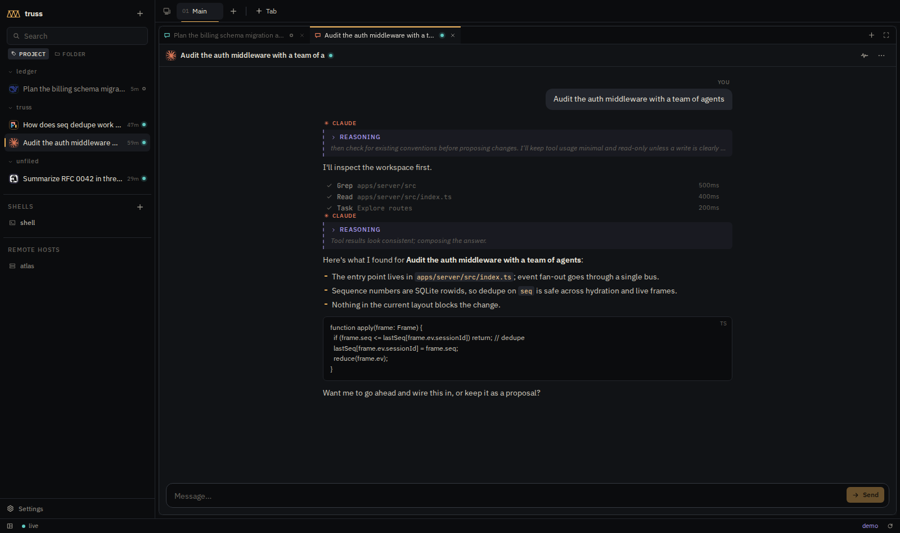
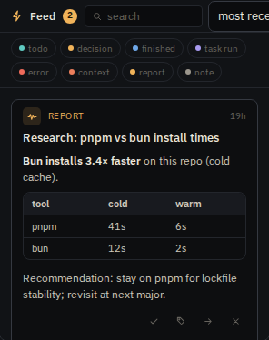
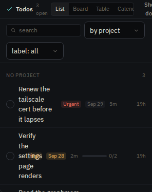

# Truss

**The head for your harnesses.**

Truss is a plugin-minded, universal web frontend for AI agentic-loop harnesses. It is *not* a harness — it hosts them. Run [pi](https://www.npmjs.com/package/@earendil-works/pi-coding-agent), [Claude Code](https://www.npmjs.com/package/@anthropic-ai/claude-code), [DeepSeek Harness](https://www.npmjs.com/package/@deepseek-ai/dsh), and Hermes side by side, pick a harness per chat, and watch every one of them through the same interface: dockable tab windows, built-in terminals, an LLM trajectory view (the Chrome network tab for model calls), context tracking, subagent visualization, an agent-facing task board, a user-facing todo list + feed inbox — all native panels.



> [!WARNING]
> **Truss is very beta.** It is a single-developer project moving fast: expect
> breaking changes between commits, rough edges, half-finished corners, and
> data-model migrations that may not be graceful. **Do not expose it to the
> public internet** (see [Security model](#security-model)). Back up
> `apps/server/data/` if you care about what's in it. That said — it is a
> real, working daily driver, and issues/PRs are welcome.

## Features

- **Every harness, one UI** — adapter per harness (pi, Claude Code, DSH, Hermes today; ACP-friendly); chat, stream, interrupt, answer permission cards, resume dead sessions with history.
- **Dockable workspace** — split panes in any direction, tabs per pane, tabs drag between panes and between *workspaces* (virtual desktops); layout persists server-side; Chrome-style tab strip (compress-to-fit, hover-X, no scrolling).
- **Trajectory** — every LLM call with model/latency/tokens/cost (incl. cache read/write), expandable into its tool calls; retries and failures at a glance.
- **Feed (inbox)** — decisions needing you (permission requests, actionable from the card), work-finished notes, crashes, context-pressure warnings, and agent-posted reports; sort/filter/save/dismiss/share-to-agent.
- **Todos** — agents file tasks *for you* (`file_todo` MCP tool) with priority, deadline, labels, subtasks, estimates, free-form fields; four views (grouped list / priority board / table / deadline calendar); per-session ownership with approval cards for cross-session edits.
- **Tasks board** — kanban of prompts you run as sessions; agents can file and run cards too (`mcp__truss__*` tools).
- **Terminals** — real shells (xterm.js + node-pty) in tabs, free or in a session's cwd.
- **Files / Git / Skills** — browse, preview, and edit the workspace tree; branch switcher, changes + diff, commit graph; skill explorer with enable/disable, create, trash.
- **Context / Team / Cost / Credentials / Router / Hosts** — occupancy gauges and subagent trees, a cost ledger with daily heat grid, and management UIs for a local key-proxy, model router, and remote node-agents.
- **TRUSS.md practices** — a CLAUDE.md for Truss: global + per-project + per-folder markdown layers delivered to agents (MCP server instructions / first prompt), covering coding *and* posting conventions.
- **Realtime everywhere** — WebSocket event bus with heartbeat, zombie-socket watchdog, and reconnect resync: open it on two devices and they stay in sync.
- **Management MCP server** — agents can drive Truss itself: sessions, prompts, terminals, tasks, todos, feed, workspaces, layout (`POST /mcp/truss`).

<p float="left">
  
  
</p>

## Setup

**Requirements:** Node.js ≥ 22, pnpm (`corepack enable && corepack prepare pnpm@latest`), and at least one harness CLI on your `PATH` (`pi`, `claude`, `dsh`, or `hermes`) configured with working models.

```bash
git clone https://github.com/roowus/truss.git
cd truss
pnpm install

# dev: fastify :4040 (tsx watch) + vite :4041 (proxies /api + /events)
pnpm dev
# open http://127.0.0.1:4041
```

**Try it with zero harnesses:** append `?demo` to the URL — the whole UI runs against a simulated in-browser backend implementing the real event contract.

**Production-ish (single binary-ish):**

```bash
pnpm -C apps/web build        # builds the single-file web app into apps/web/dist
pnpm -C apps/server start     # serves the app + REST + WS on 127.0.0.1:4040
```


**Environment:**

| Var | Default | Purpose |
|---|---|---|
| `TRUSS_PORT` | `4040` | server port |
| `TRUSS_HOST` | `0.0.0.0` | bind address |
| `TRUSS_DATA_DIR` | `apps/server/data` | SQLite store (sessions, transcripts, todos, feed, layout) |
| `TRUSS_AGENT_TOKEN` | `truss-dev` | shared secret for remote node-agents |
| `TRUSS_WEB_DIST` | `apps/web/dist` | override the served web build |

**Multiple devices:** serve it over your private overlay (tailscale serve / your LAN / an SSH tunnel). Everything syncs live.

**Import existing DSH sessions:** `POST /api/import/dsh` (sidebar button) imports persisted DeepSeek Harness sessions — transcripts and resumable refs.

## Security model

Truss is a **single-user, fully-trusted** local app: there is **no authentication or authorization boundary** in the server, and agents driving it can execute shell commands by design. Bind to loopback or your private network only. Do not put it on the public internet without a real auth layer in front of it.

## Stack & docs

- **Web**: React 19 · Vite · Tailwind 4 · Dockview · xterm.js (single-file build)
- **Server**: Fastify (Node 22) · WebSocket event bus · SQLite (better-sqlite3)
- **Protocol**: ACP at the harness boundary · internal event schema (`packages/proto`)
- [docs/architecture.md](./docs/architecture.md) — system layout, event flow, packages
- [docs/adapters.md](./docs/adapters.md) — per-harness integration contract
- [docs/ui-handoff-v2.md](./docs/ui-handoff-v2.md) — the UI redesign brief (contract vs canvas)
- [PLAN.md](./PLAN.md) — milestone log

## License

[MIT](./LICENSE) © 2026 roowus
